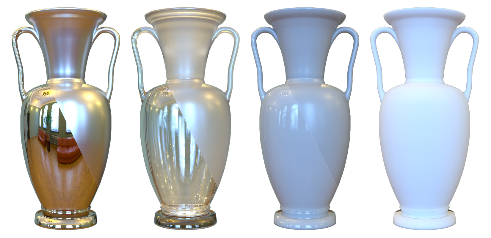

# Benchmarking_Everything

The repository contains scripts for download and evaluation on the openmaterial dataset.



we introduce the OpenMaterial dataset, comprising 1001 objects made of 295 distinct materials—including conductors, dielectrics, plastics, and their roughened variants— and captured under 723 diverse lighting conditions.

For working with this dataset, you can refer to the following steps:

## 1. Download dataset

First get your own huggingface token

1. Click on your avatar in the upper right corner and select "Settings".
2. On the "Settings" page, click "Access Tokens" on the left side.
3. Generate a new Token and copy it.

To verify the validity of the method for different materials, shapes and light conditions, you can start with our ablation dataset

```shell
python download.py --token <your-token> --type ablation
```

If you need the complete dataset, you can run the following command:

```shell
python download.py --token <your-token> --type all
```

Or if you need to download a subset of a certain material type separately, such as "conductor", you can run the following command:

```shell
python download.py --token <your-token> --type conductor
```

after downlaod complete dataset, The following file structure is obtained

```shell
datasets
├── groundtruth
│   ├── 5c4ae9c4a3cb47a4b6273eb2839a7b8c
│       └── clean_5c4ae9c4a3cb47a4b6273eb2839a7b8c.ply
│   ├── 5c0514eae1f94f22bc5475fe0970cd28
│       └── clean_5c0514eae1f94f22bc5475fe0970cd28.ply
│   └── ... 
├── openmaterial
│   ├── 5c4ae9c4a3cb47a4b6273eb2839a7b8c
│       ├── train
│           ├── images
│           ├── mask
│       ├── test
│       ├── transforms_train.json
│       └── transforms_test.json
│   ├── 5c0514eae1f94f22bc5475fe0970cd28
│   └── ... 
```

(optional) If you need to use depth, please use the following command:

```shell
python download.py --token <your-token> --type all --depth
```

Here is an example for using our depth data, which are real depth values, not normalised:

```python
with h5py.File(filename, 'r') as hdf:
    dataset = hdf['depth']
    depth = dataset[:]  # size: (1200, 1600) 
```

## 2. Start training

for ${method}: (method can be instant-nsr-pl, NeuS2, and so on...)

```shell
cd ${method}
chmod +x run_openmaterial.sh
bash run_openmaterial.sh $start $end $gpu 
# The $start and $end parameters are used to run batches, e.g. you need to run the 0th-50th case on gpu:0
# for example: bash run_openmaterial.sh 0 50 0 
cd ../
```

the result of nerf are stored in the "instant-nsr-pl-output-womask/output.txt" in the following format:

```shell
${object}:${method}:${material}:${PSNR}-${SSIM}
```

## 3. Eval

### Ablation dataset

If you want to use our script to evaluate on ablation dataset, make sure you store the mesh in the following file format:

```shell
Mesh-ablation
├── instant-nsr-pl-wmask
│   ├── meshes
│       ├── 5c4ae9c4a3cb47a4b6273eb2839a7b8c
│           └── cobblestone_street_night_4k-conductor.obj
│           └── ...     
│       ├── 5c0514eae1f94f22bc5475fe0970cd28
│           └── cobblestone_street_night_4k-conductor.obj
│           └── ...     
│       └── ... 
```
Then calculate chamfer distance after training:

```shell
bash eval/eval_mitsuba.sh ../Mesh-ablation ../output-ablation ${method} true
# for example:
# bash eval/eval_mitsuba.sh ../Mesh-ablation ../output-ablation instant-nsr-pl-wmask true
```

the result are stored in the "output-ablation/${method}-mesh-output.txt" in the following format:

```shell
${object}:${method}:${envmap}-${material}:${cds}
```

Run the following command to integrate the results:

```shell
python sum_metrics-ablation.py --method insr
```


### Complete dataset

If you want to use our script to evaluate on complete dataset, make sure you store the mesh in the following file format:

```shell
Mesh
├── instant-nsr-pl-wmask
│   ├── meshes
│       ├── 5c4ae9c4a3cb47a4b6273eb2839a7b8c
│           └── diffuse.ply
│       ├── 5c0514eae1f94f22bc5475fe0970cd28
│           └── diffuse.ply
│       └── ... 
```

Then calculate chamfer distance after training:

```shell
bash eval/eval_mitsuba.sh ../Mesh ../output ${method}
```

the result are stored in the "output/${method}-mesh-output.txt" in the following format:

```shell
${object}:${method}:${material}:${cds}
```

Run the following command to integrate the results:

```shell
python sum_metrics.py
```
